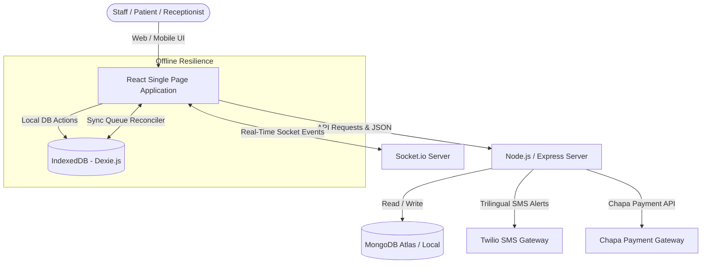
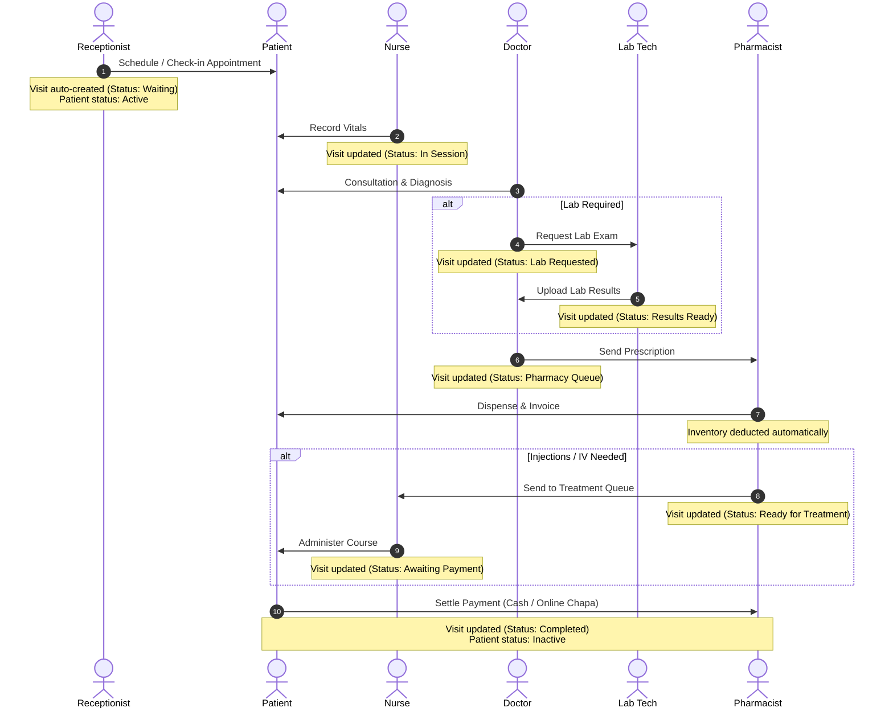

# HealthCare Pro — System Description & Architecture Document

Welcome to the comprehensive system documentation for **HealthCare Pro** (Awetu Clinic Platform). This document serves as the single source of truth detailing the system architecture, frontend and backend technology stack, module structures, workflows, database schemas, and advanced features like offline capability, real-time synchronization, and trilingual localization.

---

## 🗺️ System Overview & Architecture

**HealthCare Pro** is an enterprise-grade Clinic and Hospital Management System (HMS) built for high availability, low latency, real-time synchronization, and complete offline resilience. The system integrates patient registration, custom visit workflows, trilingual medical records, digital pharmacy prescriptions with automatic inventory deduction, trilingual patient alerts, manual & automated billing invoicing, and Chapa payment integration.

### 🏛️ High-Level Architecture Diagram

---

## 🛠️ Technology Stack

### 💻 Client-Side (Frontend)
- **Core Framework**: React (Single Page Application via Vite)
- **Routing**: `react-router-dom` (Version 6)
- **Local Persistence & Offline Engine**: **Dexie.js** (IndexedDB wrapper) enabling fast local queries, optimistic UI updates, and background sync queues.
- **Styling & Theme Engine**: Vanilla CSS with variables for rapid customized skinning, responsive layouts, glassmorphism panels, and dynamic micro-animations.
- **Icons**: Lucide Icons (`lucide-react`)
- **Real-Time Client**: `socket.io-client` for persistent full-duplex bi-directional connection.
- **Global Contexts**:
  - `AuthContext`: Manages native authentication, login session preservation, and role-based access.
  - `DataContext`: Centralizes reactive state variables, triggers background reconciliations, handles API interactions, and manages local offline caches.
  - `SocketContext`: Orchestrates WebSocket connections and real-time events.
  - `ThemeContext`: Toggles global light/dark/glass themes.

### ⚙️ Server-Side (Backend)
- **Runtime Environment**: Node.js (ES Module system)
- **Web Application Framework**: Express.js
- **Database Object Modeling (ODM)**: Mongoose (MongoDB)
- **Real-Time Communication**: Socket.io Server (integrated with Express HTTP server)
- **Process Manager**: Nodemon (Development auto-reload)
- **Third-Party Integrations**:
  - **Twilio SMS**: Handles localization-aware clinical SMS notifications.
  - **Chapa API**: Facilitates secure online payments for Amharic and Oromic contexts (Telebirr, CBE Birr).

---

## 👤 User Roles & Access Control

The platform enforces strict role-based access control (RBAC) to ensure medical privacy, compliance, and streamlined clinical workflow division:

| Role | Core Responsibilities | Key Dashboard Panels |
| :--- | :--- | :--- |
| **Admin** | System setup, global announcements, department modifications, advanced system configurations. | All Modules, Announcements, Analytics |
| **Receptionist** | Patient registration, scheduling appointments, checking in patients (automatically creating visits and activating status). | Overview, Patients, Appointments, Announcements |
| **Nurse** | Capturing vital signs, preparing queue states, administering injections/treatments, checking chronic care status. | Overview, Patients, Medical Records (Vitals, Treatments) |
| **Doctor** | Diagnosing patients, requesting lab exams, writing trilingual prescriptions, authorizing referrals. | Overview, Patients, Medical Records, Appointments |
| **Lab Technician** | Reviewing requested tests, uploading specimens/results, updating lab status to 'Results Ready'. | Overview, Medical Records (Lab) |
| **Pharmacist** | Reviewing prescription queue, dispensing medicines, calculating stock amounts, generating pharmacy bills. | Overview, Pharmacy Billing, Inventory |
| **Patient** | Viewing personal medical records, reviewing schedules, online payment of invoices via Chapa. | Patient Portal, Appointments, Profile, Settings |

---

## 📈 Clinic Visit & Workflow Lifecycles

---

## 📦 Database Schemas (Data Models)

### 1. Patient (`Patient.js`)
Stores structural patient identification, medical alerts, language preferences, and activity status.
- `pid` (String, unique): Public patient identifier (e.g., `P-1234`).
- `name` (String, required): Full name of the patient.
- `age` (Number, required): Age.
- `gender` (String, required): Gender.
- `phone` (String, required): Trilingual SMS-enabled phone number.
- `dob` (String): Date of birth.
- `allergy` (String): Allergy notices (default: `'None'`).
- `lastVisit` (String): Date of the latest medical encounter.
- `status` (String, default `'Active'`): Current status (`'Active'`, `'Inactive'`, `'Referred'`).
- `preferredLanguage` (String): Language choice (`'English'`, `'Amharic'`, `'Oromic'`).

### 2. Appointment (`Appointment.js`)
Manages calendar schedulers and doctor-patient queue slots.
- `appointmentId` (String): Public booking reference.
- `patientId` (String): ID reference to Patient.
- `patientName` (String): Denormalized patient name.
- `doctorId` (String): ID reference to Doctor.
- `doctorName` (String): Denormalized doctor name.
- `date` (String): Scheduled date.
- `timeSlot` (String): Time window.
- `status` (String, default `'Scheduled'`): Encounter status (`'Scheduled'`, `'Checked-In'`, `'Completed'`, `'Cancelled'`).
- `reason` (String): Clinical motive.
- `checkInTime` (Date): Check-in timestamp.

### 3. Visit (`Visit.js`)
Active clinic encounter tracker.
- `visitId` (String, unique): Public reference (e.g., `V-54321`).
- `patientId` (String): ID reference to Patient.
- `patientName` (String): Denormalized name.
- `date` (String): Encounter date.
- `time` (String): Check-in time.
- `type` (String): (`'Follow-up'`, `'Chronic Care'`, `'Lab Result Review'`).
- `doctor` (String): Assigned physician name.
- `status` (String, default `'Waiting'`): Active status (`'Waiting'`, `'In Session'`, `'Lab Requested'`, `'Results Ready'`, `'Pharmacy Queue'`, `'Ready for Treatment'`, `'Awaiting Payment'`, `'Completed'`, `'Cancelled'`, `'Referred'`).
- `reason` (String): Complaint details.

### 4. Record (Medical History / Vitals) (`Record.js`)
Unified history repository for clinical notes.
- `recordId` (String): Transaction identifier.
- `patientId` (String): Patient reference.
- `visitId` (String): Visit reference.
- `type` (String): (`'Vitals'`, `'Diagnosis'`, `'Lab Request'`, `'Lab Result'`, `'Treatment/Procedure'`, `'Referral'`).
- `vitals` (Object): Custom parameters (`bp`, `pulse`, `temp`, `weight`, `spo2`, `glucose`).
- `notes` (String): Rich-text clinical notes.
- `tests` (Array of Strings): Requested laboratory tests.
- `results` (Array of Objects): Lab test outcomes.
- `referredTo` (String): Destination clinic for referrals.
- `referredReason` (String): Reason for referral.

### 5. Prescription (`Prescription.js`)
Pharmacy medication list.
- `prescriptionId` (String): Public code.
- `patientId` (String): Patient reference.
- `visitId` (String): Visit reference.
- `items` (Array of Objects): Contains `medicineId`, `name`, `dosage`, `frequency`, `duration`, `requestedQty`, `dispensedQty`, `status` (`'PENDING'`, `'DISPENSED'`, `'OUT_OF_STOCK'`).
- `status` (String): (`'PRESCRIBED'`, `'PARTIALLY_DISPENSED'`, `'DISPENSED'`).

### 6. Inventory (`Inventory.js`)
Medication and stock management.
- `itemId` (String): Product code.
- `name` (String): Medicine/Consumable name.
- `stock` (Number): Dynamic quantity in stock.
- `unitPrice` (Number): Price per unit.
- `status` (String): Stock state (`'In Stock'`, `'Low Stock'`, `'Out of Stock'`).

### 7. Bill (Billing / Invoices) (`Bill.js`)
Finance module ledger.
- `invoiceId` (String): Public invoice identifier.
- `patientId` (String): Patient reference.
- `visitId` (String): Visit reference.
- `items` (Array of Objects): Billed lines (`desc`, `qty`, `cost`).
- `totalAmount` (Number): Total fee.
- `paidAmount` (Number): Dynamic sum settled.
- `status` (String): Payment status (`'Unpaid'`, `'Partial'`, `'Paid'`).
- `payments` (Array of Objects): Transactions list (`txId`, `amount`, `date`, `method` (`'Cash'`, `'Telebirr'`, `'CBE Birr'`, `'Chapa'`), `recordedBy`).

### 8. Message (Patient-Receptionist Chat) (`Message.js`)
Real-time messaging logs between patients and the clinic reception desk.
- `senderId` (String): Reference to User (receptionist) or Patient.
- `senderName` (String): Full name of the sender.
- `senderRole` (String): Sender's role (`'Patient'` or `'Receptionist'`).
- `receiverId` (String): Reference to receiver.
- `receiverName` (String): Full name of the receiver.
- `receiverRole` (String): Receiver's role.
- `message` (String): Text content of the secure message.
- `isRead` (Boolean, default `false`): Unread status identifier.

---

## ⚡ Offline Resilience & Real-Time Reconcilation

One of the standout design characteristics of **HealthCare Pro** is its custom **Offline-First Synchronization Engine**:

1. **Instant UI Updates**: When a staff member performs a write action (e.g. registers a patient or logs vital signs) while offline:
   - The browser registers the action in **IndexedDB** using **Dexie.js**.
   - The React UI displays the updated records immediately using temporary identifiers (e.g., `TEMP-` or `V-TEMP-`).
   - The system appends a job request to the local `syncQueue` table with a status of `pending`.
2. **Connectivity Listener**: The SPA continuously monitors internet status using `window.addEventListener('online')`.
3. **Background Reconciler**: As soon as the network connection is restored, the `DataContext` reconciler loop:
   - Reads all `pending` sync queue items sequentially.
   - Dispatches HTTP POST requests to the backend server.
   - Cleans up temporary local database keys and seamlessly swaps them with primary keys generated by MongoDB.

---

## 🌍 Trilingual Localization & Notification Engine

The system supports localized engagement tailored for **English, Amharic, and Oromic** patient groups:

- **UI Translations Hook**: Utilizing `useTranslation(preferredLanguage)` ensures navigation buttons, form labels, and operational alerts load instantly in the user's selected language.
- **Dynamic Localization Engine**: System alerts sent via Persistent notifications or SMS translate text dynamically based on the specific patient's preferred language configuration. For instance, when checking in, patients receive personalized, bilingual SMS and in-app alerts detailing their doctor and appointment times.
