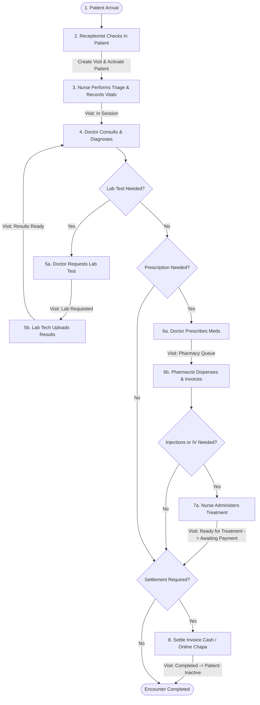

# HealthCare Pro — Detailed System Operations Flow

This document provides a step-by-step operational walkthrough of the workflows in **HealthCare Pro** (Awetu Clinic Platform). It maps out how patients, receptionists, nurses, doctors, lab technicians, and pharmacists interact with the application, showcasing state changes, database modifications, and automated tasks.

---

## 🗺️ Master Operational Flowchart

---

## 📑 Step-by-Step Flow Breakdown

### 1. Receptionist & Check-In Flow (Appointment Check-in)
* **Action**: When a receptionist clicks **Check-In** on the Appointments screen:
  * **Backend Activity**:
    1. The `updateAppointmentStatus` controller changes the appointment's status to `Checked-In` and records the `checkInTime`.
    2. The controller queries if the patient has an existing active visit. If not, it **automatically creates a new Visit record** (default status: `Waiting`).
    3. The patient's status in the database is automatically updated to `Active`, and their `lastVisit` date is set to today.
    4. A real-time `patient-updated` socket.io event is broadcast.
  * **Database State Transitions**:
    * **Appointment**: `status: "Scheduled"` ➔ `status: "Checked-In"`
    * **Patient**: `status: "Inactive"` ➔ `status: "Active"`
    * **Visit**: Created with `status: "Waiting"`

---

### 2. Nurse & Triage Flow (Recording Vitals)
* **Action**: The nurse selects the patient from the "Waiting" queue on the dashboard and records their vital signs (BP, Pulse, Temperature, Weight, SpO2, and Blood Glucose):
  * **Backend Activity**:
    1. A new `Record` document of type `Vitals` is created in MongoDB.
    2. The current `Visit` status is updated to `In Session`.
  * **Database State Transitions**:
    * **Record**: Created with `type: "Vitals"` linked to `patientId` and `visitId`.
    * **Visit**: `status: "Waiting"` ➔ `status: "In Session"`.

---

### 3. Doctor Consultation & Diagnosis Flow
* **Action**: The doctor views the patient's vitals, medical history, and records a diagnosis, clinical notes, and optional lab requests or prescriptions:
  * **A. Lab Request Path**:
    * The doctor submits a list of lab tests (e.g., CBC, Widal, Urinalysis).
    * **Database**: A `Record` of type `Lab Request` is created. The active `Visit` status is updated to `Lab Requested`.
    * **Socket.io**: Broadcasts a persistent notification to the **Lab Technician** role.
  * **B. Lab Results Path**:
    * The lab technician takes samples, runs tests, and enters the results in the system.
    * **Database**: The `Record` is updated with results. The `Visit` status changes to `Results Ready`.
    * **Socket.io**: Broadcasts a notification directly to the assigned **Doctor**.
    * The doctor reviews the results, returns the patient to `In Session` status, and enters a final diagnosis.

---

### 4. Pharmacy & Dispensing Flow (Prescriptions & Stock Deduction)
* **Action**: The doctor prescribes medications via a digital form:
  * **Backend Activity**:
    1. A `Prescription` document is created with status `PRESCRIBED`.
    2. The `Visit` status is updated to `Pharmacy Queue`.
    3. A notification is sent to the **Pharmacist** role.
  * **Pharmacist Dispensing**:
    1. The pharmacist opens the patient's prescription from the pharmacy queue.
    2. Selects available medicine brands, adjusts quantities, and clicks **Dispense**.
    3. **Stock Update**: The system automatically deducts the dispensed quantities from the `Inventory` collections.
    4. **Auto-Invoicing**: An invoice (`Bill`) is automatically generated containing all dispensed items and their unit prices.

---

### 5. Treatment & Procedure Administration Flow (Nurse Injection / IV)
* **Action**: If a dispensed medication includes injections, IV, or local treatments (e.g., Diclofenac Inj, IV fluids):
  * **Backend Activity**:
    1. The dispensing process detects the treatment tags and sets the `Visit` status to `Ready for Treatment`.
    2. The patient appears on the **Nurse Dashboard** treatment queue.
  * **Nurse Action**:
    1. The nurse administers each dose and logs it in the system.
    2. Once the course is complete, the nurse confirms it.
    3. The `Visit` status changes to `Awaiting Payment`.

---

### 6. Billing, Settlement, & Checkout Flow
* **Action**: The patient settles their medical bill (Cash or Online Chapa):
  * **Payment Methods**:
    * **Cash**: The cashier records the cash transaction.
    * **Online Payment (Chapa)**: The patient pays via Telebirr or CBE Birr on their portal. The webhook validates the transaction via the `/api/billing/verify` endpoint.
  * **Checkout & Closing**:
    1. The `Bill` status becomes `Paid`.
    2. The `Visit` status is updated to `Completed`.
    3. The `Patient` status is updated to `Inactive`, ready for their next clinic encounter.
    4. Sockets broadcast the update to clear all active screens.

---

### 7. Real-Time Patient-Receptionist Messaging Flow
Provides a secure communications channel between patients and clinic receptionists.
* **Flow details**:
  1. **Initiation**: The patient selects "Messages" on their dashboard, loading a list of active receptionists.
  2. **Real-Time Delivery**: Messages typed and sent route instantly via Socket.io to the recipient's private room, generating visual and audio notifications.
  3. **Operational Shortcuts**: Patients can click "Request Appointment", "Lab Inquiry", or "Billing Help" shortcuts to auto-generate formatted operational messages.
  4. **Active Read Receipts**: Double-check indicators update dynamically as soon as the recipient opens the active chat window, firing a `messages-read-ack` socket.

